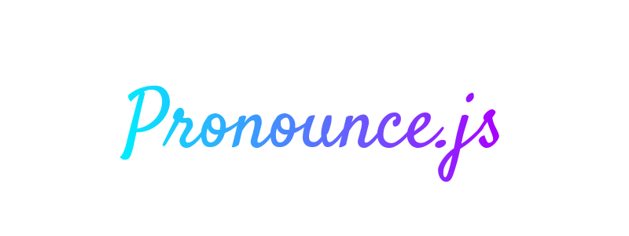

# :capital_abcd: Pronounce.js 

 
 




:unicorn: Simple utility to convert word to pronounceable word.


### :package: Requirements
Node.js 12.x LTS or 14.x (or Higher) LTS

### :sparkles: Installation

Install the NPM Package with the below command:
```
npm install node-pronounce --save
``` 

 (or)

Install with Yarn:
```
yarn add node-pronounce
```

### :pen: Usage

Import the module in your project:

```javascript
// Commonjs Import
var { pronounce } = require("node-pronounce");

// or ES6 import
import { pronounce } from "node-pronounce";
```

### :bulb: Example

Pass the Number to the function

```javascript
import { pronounce } from "node-pronounce";

const word = "automation";
console.log(pronounce(word));
```

### :ballot_box_with_check: Example Output
```
automaxion
```

### :shield: LICENSE

- MIT
---

#### :green_heart: Message

I hope you find this useful. If you have any questions, please create an issue.

---

#### 💰 Help me with your donation

<a href="https://www.buymeacoffee.com/mcnaveen" target="_blank"></a>